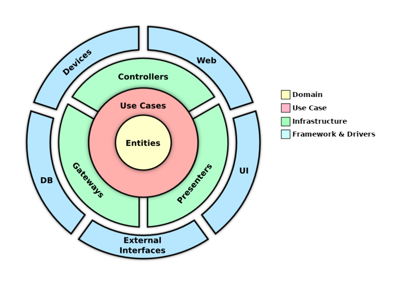

# API in Go using Clean Architecture
[Clean architecture](https://blog.cleancoder.com/uncle-bob/2012/08/13/the-clean-architecture.html) example using golang, this project exemplifies the use of clean arch with more than one type of communication and more than one way of data persistence

Examples of types of communication;
- API
- CLI

Examples of data persistence;
- Mysql
- Mongo
- In memory

## 🏷 Contents
* [Technologies](#-technologies)
* [Description](#-description)
  * [Domain](#domain)
  * [Infrastructure](#infrastructure)
  * [Use case](#use-case)
* [Installing](#-installing)
* [Development setup](#-development-setup)
* [CLI Documentation](#-cli-documentation)
* [API Documentation](#-api-documentation)

## 📌 Technologies
- Mysql (https://www.mysql.com/)
- Go (https://go.dev/)
- Fiber (https://docs.gofiber.io/)
- GORM (https://gorm.io/)
- Cobra (https://github.com/spf13/cobra)
- Validator (https://github.com/go-playground/validator/)
- Swagger (https://github.com/swaggo/swag and https://github.com/gofiber/swagger)

## 📄 Description
The folder structure of this application was separated thinking about the clean architecture layers, so the application was separated into three main folders, domain, infrastructure and usecase

Each of these folders represents a layer of clean architecture how you can see in image below;


To cross the layers we must always use the [Dependency Inversion Principle](http://en.wikipedia.org/wiki/Dependency_inversion_principle) this way the direction of dependencies will be from the outer layer to the inner layer. Due to this, business logic and entities remain independent from other parts of the system.


### Domain
Here is where you will but your entity.

Usually people also use the domain to put interfaces that will be used in the others layers of application, it's also common the entity be self validated based of DDD, but in my case I chose use the layer to put only my entity without validation

### Infrastructure
Here is where you put adapters to communicate with the outside world like library, resource of framework, database or web

- All components of this layer are unaware of each other's existence, if you need two different components to communicate you must do it through the inner layer
- All calls to the inner layer are made through the interface
- Data is transferred in a format that is convenient for business logic

### Use case
Here is where you will put your  business logic, remember your business logic knows nothing about outside world, that is, library, database or about web

- Not have package imports from the outer layer.
- Use only the capabilities of the standard library.
- Make calls to the outer layer through the interface.

## ⚙️ Installing
Run docker containers   
```sh
docker-compose up -d
```

If you want the API version. Run this command and access the url http://127.0.0.1:5001
```sh
docker exec -it builder.clean-arch make run-api

```

If you want the CLI version. Run this command and follow the terminal instructions
```sh
docker exec -it builder.clean-arch make run-cmd
```
## 🧑‍💻 Development setup
For local development you can use `make dev` command, this will update your api server whenever there is modification

You can use MAKE on your own computer or inside a container running this command
```sh
make dev
```
```sh
docker exec -it builder.clean-arch make dev
```

## 📒 Refresh Swagger Documentation
If you want to refresh swagger documentation just run command below

```sh
make generate-swag
```


## 💻 CLI Documentation
If you are runing the CLi versioning of aplication, here you will can see some available command to use.

Change `cmd-file` for your builded file or for command `docker exec -it builder.clean-arch make run-cmd`

### User Create
```shell
cmd-file user create -n=teste -e=teste@gmail.com
```


### User Update
```shell
cmd-file user update -n=teste -e=teste@gmail.com -i=12
```

## 🌐 API Documentation
API Documentation was created with swagger and is available at `http://localhost:5001/docs`

## 📝 To Do 
- Repository using mongo
- Write Tests