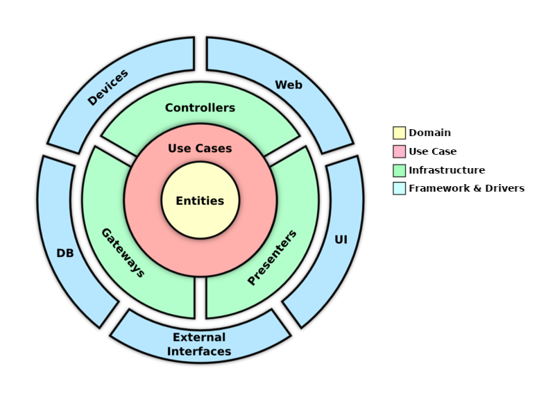

# API in Go using Clean Architecture
API RESTFul to exemplify the use of clean architecture using go language

The folder structure of this application was separated thinking about the clean architecture layers, so the application was separated into three main folders;
- Domain
- Infrastructure
- Use cases

Each of these folders represents a layer of clean architecture;


## 📌 Stack
- Mysql (https://www.mysql.com/)
- Go (https://go.dev/)
- Fiber (https://docs.gofiber.io/)
- GORM (https://gorm.io/)
- Cobra (https://github.com/spf13/cobra)

## 🚀 Install
Run docker containers
```sh
docker-compose up -d
```

If you want the API version. Run this command and access the url http://127.0.0.1:5001
```sh
docker exec -it builder.clean-arch make run-api

```

If you want the CLI version. Run this command and follow the terminal instructions
```sh
docker exec -it builder.clean-arch make run-cmd
```

## 🧑‍💻 Development
For local development you can use `make dev` command, this will update your api server whenever there is modification

You can use MAKE on your own computer or inside a container running this command
```sh
make dev
```
```sh
docker exec -it builder.clean-arch make dev
```


## 💻 CLI Documentation
If you are runing the CLi versioning of aplication, here you will can see some available command to use.

Change `cmd-file` for your builded file or for command `docker exec -it builder.clean-arch make run-cmd`

### User Create
❯ `cmd-file` user create -n=teste -e=teste@gmail.com

### User Update

❯ `cmd-file` user update -n=teste -e=teste@gmail.com -i=12

## 🌍 API Documentation

## User

### 1. Create
```sh
curl --location --request POST 'http://localhost:5001/users/' \
--header 'Content-Type: application/json' \
--data-raw '{
  "name": "teste"
}'
```

### 2. Delete
```sh
curl --location --request PUT 'http://localhost:5001/users/1' \
--header 'Content-Type: application/json' \
--data-raw '{
  "name": "teste2"
}'
```

### 4. List
```sh
curl --location --request GET 'http://localhost:5001/users' \
--header 'Content-Type: application/json'
```

### 4. Find
```sh
curl --location --request GET 'http://localhost:5001/users/2' \
--header 'Content-Type: application/json'
```

### 5. Update
```sh
curl --location --request PUT 'http://localhost:5001/users/1' \
--header 'Content-Type: application/json' \
--data-raw '{
  "name": "teste2"
}'
```

## 📝 To Do 
- Book entity
- Repository saving to memory
- Write Tests